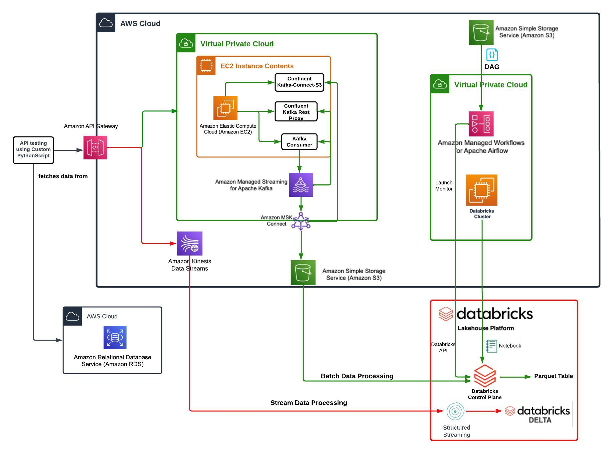

# Pinterest Data Pipeline

The goal of this project is to demonstrate a practical understanding of data engineering principles for the [AiCore Data Engineering Bootcamp](https://www.theaicore.com/launch/data-engineering), an introductory training course for data engineers. To do so, we will construct a data pipeline for processing data based on data resembling the social media website Pinterest.

The project has two main components:

- A `batch workflow` that processes Pinterest data in bulk on a daily schedule.
- A `streaming workflow` that processes the same data in real-time, as the data is occuring. 

The data infrastructure will be built primarily on the `AWS` and `Databricks` services. 

This document will attempt to breakdown and describe the infrastructure of the pipeline and the services used in its construction.

## Table of Contents
1. [Data Pipeline Architecture At A Glance](#1.-data-pipeline-architecture-at-a-glance)
2. [Pinterest Data Emulation](#2.-pinterest-data-emulation)
3. [Batch Workflow](#3.-the-batch-workflow)
    - [Kafka](kafka)
4. [Streaming Workflow](#3.-the-streaming-workflow)
5. [Service Links](#5.-service-links)
6. [Folder Structure](#6.-folder-structure)
7. [License](#7.-license)

# 1. Data Pipeline Architecture At A Glance


### Key Project Takeaways
- AWS Cloud computing with EC2, S3 storage, and MSK
- API configuration on AWS Gateway
- Command line Kafka configuration
- Kafka data streaming using AWS Kinesis
- Airflow DAG workflow creation and MWAA deployment
- Data cleaning and analysis using Apache Spark and PySpark
- Databricks platform for data streaming, transformation, and storage

# 2. Pinterest Data Emulation
The foundation of data engineering is data. To demonstrate the practical applications of data engineering, it is necessary to first emulate data resembling real world situations. For this project, the generated data has been designed to resemble that of social media website Pinterest.

The data emulation is performed by the Python scripts found in the `user_emulation`-folder, which extract a continous stream of data from three datasets stored on an AWS relational database. To simulate user interactions as they would occur on Pinterest, data from the datasets is selected at random. The same datasets are used for both workflows.

The datasets are:

- `pinterest_data`: contains data about posts on Pinterest:
```
{"index": 5730, "unique_id": "1e1f0c8b-9fcf-460b-9154-c775827206eb", "title": "Island Oasis Coupon Organizer", "description": "Description Coupon Organizer in a fun colorful fabric -island oasis, Great Size for the \"basic\" couponer - holds up to 500 coupons with ease, and is made long enough so that you\u2026\u00a0", "poster_name": "Consuelo Aguirre", "follower_count": "0", "tag_list": "Grocery Items,Grocery Coupons,Care Organization,Coupon Organization,Extreme Couponing,Couponing 101,Life Binder,Save My Money,Love Coupons", "is_image_or_video": "image", "image_src": "https://i.pinimg.com/originals/65/bb/ea/65bbeaf458907bb079317d8303c4fa0e.jpg", "downloaded": 1, "save_location": "Local save in /data/finance", "category": "finance"}
```

- `geolocation_data`: contains data about the geolocation of each Pinterest post found in pinterest_data:
```
{"ind": 5730, "timestamp": "2021-04-19 17:37:03", "latitude": -77.015, "longitude": -101.437, "country": "Colombia"}
```

- `user_data`: contains data about the user that has uploaded each post found in pinterest_data:
```
{"ind": 5730, "first_name": "Rachel", "last_name": "Davis", "age": 36, "date_joined": "2015-12-08 20:02:43"}
```

# 3. Batch Workflow

### Overview: 
> The `user_posting_emulation.py` script sends the data through an API to an AWS EC2 client computer running Kafka, where it is forwarded for storage in an AWS S3 bucket through MSK Connect. The S3 bucket is mounted to Databricks, where the data is merged, cleaned, and analyzed in batch. The process is then automated using Airflow to run on a daily basis.

## Kafka

Prior to configuring the API

## AWS API Gateway Congiguration (Batch)

## Confluent.io Kafka Rest Proxy

## Databricks: Batch Processing 

The S3 bucket is mounted to [Databricks](https://www.databricks.com/), where it is cleaned for ease of reading and for further integration and analysis. 

The data processing is performed using [PySpark](https://spark.apache.org/docs/latest/api/python/index.html), the Python API for use with [Apache Spark](https://spark.apache.org/), a data engineering and analytics engine that can be scaled to requirements.

The data cleaning and analyis processing can be viewed in full detail in the `databricks_notebooks/batch`-folder and `databricks_notebooks/data_analysis.ipynb`-script, respectively.

## Airflow

The above processes is automated to run daily using [AWS MWAA](https://aws.amazon.com/managed-workflows-for-apache-airflow/), Amazon's hosted Apache Airflow service. [Apache Airflow](https://airflow.apache.org/) is a platform for orchestrating workflows using `DAGs` (Directed Acyclic Graphs) - workflow pipelines constructed using Python. 

The project DAG, `0affea73130b_dag.py`, can be found in the `airflow_dag`-directory. 

`0affea73130b_dag.py` uses DatabricksSubmitRunOperator-operator to run the Databricks `data_analysis.ipynb`-notebook on a daily schedule. The key components of the DAG can be indentified in the notebook_task variable on Line 7, which defines the notebook pathway to run in the DatabricksSubmitRunOperator, and the DAG schedule defined on Line 30.

**Line 7:**

```
notebook_task = {'notebook_path': '/Users/cronies-02gorilla@icloud.com/data_analysis'}

```
**Line 30:** 
```
schedule_interval='@daily'
```

# 4. Streaming Workflow

> `Streaming Workflow`: The `user_posting_emulation_streaming.py` script uses a REST API to stream data to AWS Kinesis. The streaming data is accessed in Databricks, where it is first merged and cleaned and then stored in Delta Tables.

## AWS Kinesis

## AWS API Gateway Configuration (Streaming)

## Databricks: Streaming Processing

# 5. Project Folder Structure
```
.
├── COPYING.txt / license
├── README.md / documentation
│
├── env / conda env
│   └── env.yaml
|
├── airflow_dag / batch scheduling
│   └── 0affea73130b_dag.py 
│
├── databricks_notebooks / data processing
│   │
│   ├── access.ipynb
│   ├── s3_mount.ipynb
│   │ 
│   ├── batch / batch cleaning notebooks
│   │   ├── geolocation_batch_clean.ipynb
│   │   ├── post_batch_clean.ipynb
│   │   └── user_batch_clean.ipynb
│   │
│   ├── streaming / streaming cleaning notebooks
│   │   ├── geolocation_stream_clean.ipynb
│   │   ├── post_stream_clean.ipynb
│   │   └── user_stream_clean.ipynb
│   │ 
│   └── data_analysis.ipynb / batch data analysis
│
├── credentials / security
│   └── SSH & API keys
│   
├── ignore / debugging
│   └── debugging and test scripts
│
└── user_emulation / pinterest data emulation scripts
    ├── user_posting_emulation.py
    └── user_posting_emulation_streaming.py
```

# 6. Service Links

- [Apache Airflow](https://airflow.apache.org/): *"Apache Airflow is a platform created (...) to programmatically author, schedule and monitor workflows."*
- [Apache Kafka](https://kafka.apache.org/): *"Apache Kafka is an open-source distributed event streaming platform used by thousands of companies for high-performance data pipelines, streaming analytics, data integration, and mission-critical applications."*
- [Apache Spark](https://spark.apache.org/): *"Apache Spark is a multi-language engine for executing data engineering, data science, and machine learning on single-node machines or clusters."*
- [Confluent.io Kafka REST Proxy](https://docs.confluent.io/platform/current/kafka-rest/index.html): *"The Confluent REST Proxy provides a RESTful interface to an Apache Kafka® cluster, making it easy to produce and consume messages, view the state of the cluster, and perform administrative actions without using the native Kafka protocol or clients."*
- [Databricks](https://www.databricks.com/): *"As the world’s first and only lakehouse platform in the cloud, Databricks combines the best of data warehouses and data lakes to offer an open and unified platform for data and AI."*
- [AWS API Gateway](https://aws.amazon.com/api-gateway/): *"Amazon API Gateway is a fully managed service that makes it easy for developers to create, publish, maintain, monitor, and secure APIs at any scale. APIs act as the "front door" for applications to access data, business logic, or functionality from your backend services. Using API Gateway, you can create RESTful APIs and WebSocket APIs that enable real-time two-way communication applications."*
- [AWS EC2](https://aws.amazon.com/ec2/): *"Amazon Elastic Compute Cloud (Amazon EC2) offers the broadest and deepest compute platform, with over 750 instances and choice of the latest processor, storage, networking, operating system, and purchase model to help you best match the needs of your workload."*
- [AWS IAM](https://aws.amazon.com/iam/): *"Use AWS Identity and Access Management (IAM) to manage and scale workload and workforce access securely supporting your agility and innovation in AWS."*
- [AWS Kinesis](https://aws.amazon.com/kinesis/): *"Amazon Kinesis cost-effectively processes and analyzes streaming data at any scale as a fully managed service."*
- [AWS MSK](https://aws.amazon.com/msk/): *"Amazon Managed Streaming for Apache Kafka. Securely stream data with a fully managed, highly available Apache Kafka service."*
- [AWS MSK CONNECT](https://aws.amazon.com/msk/features/msk-connect/): *"With Amazon MSK Connect, a feature of Amazon MSK, you can run fully managed Apache Kafka Connect workloads on AWS."*
- [AWS MWAA](https://aws.amazon.com/managed-workflows-for-apache-airflow/): *"Amazon Managed Workflows for Apache Airflow (Amazon MWAA) orchestrates your workflows using Directed Acyclic Graphs (DAGs) written in Python."*
- [AWS S3](https://aws.amazon.com/s3/): *"Amazon Simple Storage Service (Amazon S3) is an object storage service offering industry-leading scalability, data availability, security, and performance"*

# 7. License
Licensed under [GPL-3.0](https://github.com/tommifloor/pinterest-data-pipeline693/blob/main/COPYING.txt).

---


 

---
[Jump to Top](#pinterest-data-pipeline)

